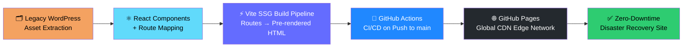

# UASH - High-Availability Disaster Recovery Site

---

## Build Automation & Deployment Infrastructure

---

## Why This Exists

Pro-bono engineering for the **Uzbek American Society of Houston** — a cultural non-profit serving the Central Asian immigrant community in Texas.
Their primary WordPress site is a single point of failure; this static replica is a bulletproof failover so the community is never left without a home online.

---

## Tech Highlights

- **Zero database queries** — every route pre-rendered to static HTML at build time via Vite SSG
- **Sub-second load times** — pure static assets served from GitHub's global CDN edge nodes
- **Automated deployments** — any push to `main` triggers a full rebuild and redeploy via GitHub Actions
- **WordPress-free** — reverse-engineered from a bloated Elementor/WP stack into a lean React + Vite project
